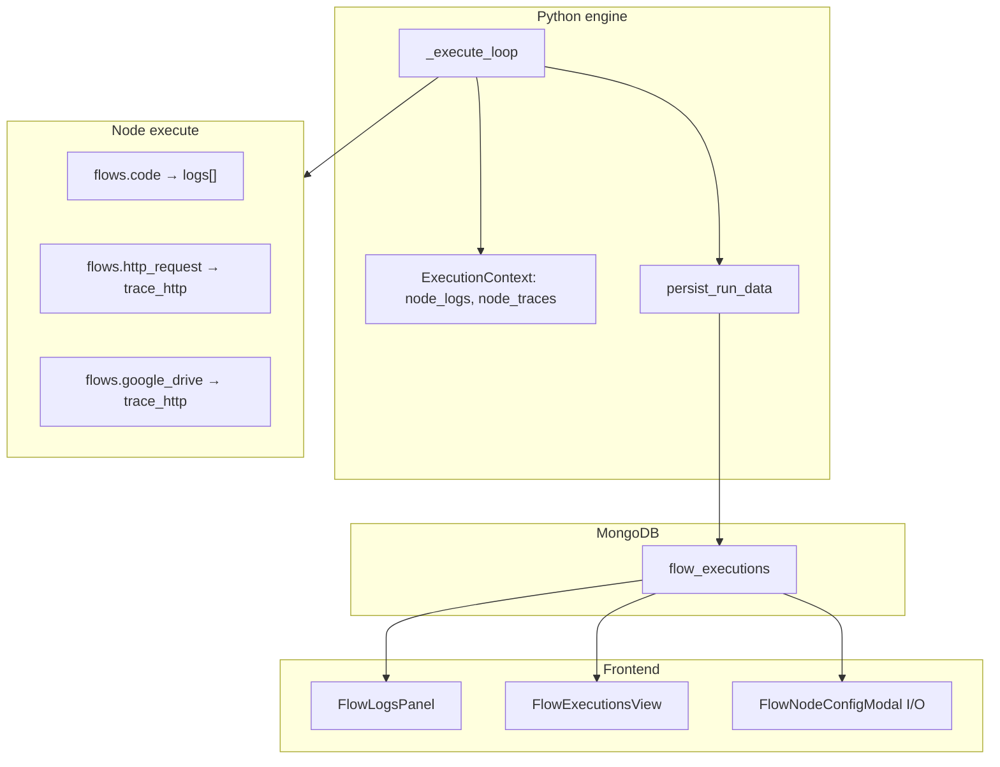

# Full execution trace and logging (plan)

This document plans **n8n-style step-by-step execution logging** for DocRouter flows: durable per-node records, rich errors, optional HTTP/integration traces, and a logs UI that makes failures easy to follow.

**Related docs**

- Engine and `run_data` today: [`flows2.md`](./flows2.md) (includes a “See also” link here)
- Logs panel UX (partial): [`flows_logs_ui_plan.md`](./flows_logs_ui_plan.md), [`n8n_ui.md`](./n8n_ui.md) §5
- n8n execution model reference: [`n8n.md`](./n8n.md) (stack / waiting maps, `ITaskData`, error workflow)
- Binary offload (must stay compatible): [`docrouter_binary.md`](./docrouter_binary.md)

---

## Goals

1. **Step-by-step visibility** — After a run, see which nodes executed, in what order, with timing and status (success / error / skipped / waiting).
2. **Actionable failures** — On error: node id/name, human message, **Python stack trace**, and (where useful) structured HTTP/API context (method, URL, status, truncated body).
3. **Item lineage** — For multi-item runs, know which upstream node/slot/item produced each output (n8n `source` / `paired_item` parity).
4. **Incremental persistence** — Keep writing progress after each node (today’s `persist_run_data`) so long runs and crashes still leave a trace.
5. **UI parity (core)** — Logs panel Overview/Details, Executions tab, and node modal I/O columns all consume the same normalized execution payload.

## Non-goals (initial phases)

- OpenTelemetry / distributed tracing across services
- Log streaming over WebSockets during run (polling `GET execution` is enough for v1)
- Sub-workflow / nested execution trees (no child workflow runs yet)
- PII redaction policy engine (n8n’s `redactedError`) — design hooks only
- Replacing worker stdout logging; trace data lives in MongoDB, worker logs stay for ops
- **Parallel branch execution** — the engine runs nodes **serially** today (see [Concurrent execution](#concurrent--parallel-execution)); `execution_index` assumes one node at a time until parallel execution is designed

---

## Current state (DocRouter)

| Area | Today | Gap vs n8n |
|------|--------|------------|
| **Storage** | `flow_executions.run_data[node_id]` — one record per node per run | n8n: `runData[nodeName][]` — **array** of runs per node (retries, per-item batches) |
| **Timing** | `start_time`, `execution_time_ms`, `status`, **`execution_index`** (Phase 0) | n8n: `startTime`, `executionTime`, `executionIndex`, `executionStatus` |
| **Errors** | **`error.stack`**, `cause`, optional `http_code` on failed nodes (Phase 0) | n8n: full `ExecutionError` (message, description, stack, httpCode, …) |
| **Top-level error** | `flow_executions.error` — full envelope when run stops; **`last_node_executed`** on doc (Phase 0) | n8n: `resultData.error` + last node executed |
| **Provenance** | `FlowItem.meta`, partial `paired_item` | n8n: `ITaskData.source[]` **per input slot** |
| **Node console** | `run_data[node_id].logs` for **`flows.code`** only | n8n: log output mode for code nodes; integration nodes rely on error + data |
| **Integration debug** | **`trace[]`** on HTTP/Drive failures; optional debug HTTP at `LOG_LEVEL=DEBUG` (Phase 1) | n8n: error string + data only |
| **UI** | `FlowLogsPanel` Overview/Details, **Trace tab**, `IoViewer`, Download JSON | n8n: log tree, sub-execution links, richer error panel |

Key code paths today:

- Engine loop: `packages/python/analytiq_data/flows/engine.py` (`_execute_loop`, `persist_run_data`)
- Worker: `packages/python/analytiq_data/msg_handlers/flow_run.py`
- Context: `packages/python/analytiq_data/flows/context.py` (`node_logs`, `node_traces`, `active_trace_node_id`)
- Trace helpers: `packages/python/analytiq_data/flows/trace.py`
- UI: `packages/typescript/frontend/src/components/flows/FlowLogsPanel.tsx`, `flowNodeTracePanel.tsx`, `flowNodeRunErrorDetails.tsx`

---

## Target model (n8n-aligned, DocRouter ids)

DocRouter keeps **stable node `id`** as the `run_data` key (see [`flows2.md`](./flows2.md)); display names come from revision `nodes[].name`.

### Top-level execution document (`flow_executions`)

Fields on the **execution document** (not inside `run_data[node_id]`):

```json
{
  "_id": "6a116a29f47553e68173f2ec",
  "flow_id": "6a0f5634627e80c37b7067bd",
  "flow_revid": "6a116446f9f8a0c8374304b7",
  "organization_id": "6795345439604beca2b2808d",
  "mode": "manual",
  "status": "success | error | running | stopped | queued",
  "started_at": "2026-05-23T08:49:45.812Z",
  "finished_at": "2026-05-23T08:49:52.996Z",
  "last_heartbeat_at": "2026-05-23T08:49:52.996Z",
  "last_node_executed": "b81abd6d-873d-477b-83a6-d5eaf8d13e72",
  "run_data": { "...": "NodeRunData v2 per node id" },
  "error": null,
  "trigger": { "type": "manual" }
}
```

| Field | Purpose |
|-------|---------|
| `last_node_executed` | **Stable node `id`** (same key as `run_data`) for the last node that **started** execution in the engine loop — updated after each node completes or fails. Used by the UI to attach top-level `error` to the Trace tab and to auto-select the failing node. Not the display name. |
| `error` | Top-level failure envelope (same shape as node `error`) when the run stops; prefer copying from the failing node’s `run_data` entry when available. |
| `run_data` | Map of node id → per-node run record (below). |

Set via `persist_run_data(..., last_node_executed=node["id"])` in `engine.py` and read by `GET .../executions/{id}` / SDK `FlowExecution.last_node_executed`.

### 1. Per-node run record (`NodeRunData` v2)

Evolve the shape stored under `run_data[node_id]` (backward compatible: readers accept v1 and v2).

```json
{
  "status": "success | error | skipped | running",
  "start_time": "2026-05-23T11:20:33.123Z",
  "execution_time_ms": 412,
  "execution_index": 3,
  "data": { "main": [[{ "json": {}, "binary": {}, "meta": {}, "paired_item": null }]] },
  "error": null,
  "source": [
    [
      {
        "previous_node_id": "trigger-1",
        "previous_node_output": 0,
        "previous_node_run": 0
      }
    ]
  ],
  "logs": ["line from code node print()"],
  "trace": []
}
```

| Field | Purpose |
|-------|---------|
| `execution_index` | Global order counter within the execution (n8n `executionIndex`); assigned when the node **starts** in `_execute_loop` (Phase 0). |
| `source` | **Per input slot** (n8n `ISourceData`): outer array index = input slot number (`0`, `1`, …). Each slot holds zero or more upstream provenance records. Empty slot = `[]`. For nodes with a single input (most nodes today), `source` is length `1`. Merge nodes with two inputs use `source[0]` and `source[1]`. |
| `logs` | Text lines from **`flows.code`** `print()` / captured stdout (user-owned content; see [Redaction scope](#redaction-scope)). |
| `trace` | Engine/integration debug events (see below); capped before persist. |

**Item `meta` on output rows:** After each node runs, the engine sets `meta.source_node_id` on every output item to **that node’s id** (immediate producer). Use `run_data[node].source` for “who fed this execution’s inputs”; use `meta.source_node_id` on items for “who produced this row” (timing expressions, item-level debugging). Both align on the same hop for the producing node’s output.

**Multi-run per node (phase 4):** Optional migration to `run_data[node_id]` → **array** of records (true n8n parity for per-item re-executions). Phases 0–2 keep one merged record per node; store `runs: NodeRunData[]` only when a node executes multiple times with distinct errors/outputs.

### 2. Trace events (`trace[]`)

Lightweight, append-only events captured during `execute()` — not a second logging system.

```json
{
  "ts": "2026-05-23T11:20:37.456Z",
  "level": "info | warn | error | debug",
  "kind": "http | oauth | validation | engine",
  "message": "POST https://www.googleapis.com/upload/drive/v3/files → 404",
  "detail": {
    "method": "POST",
    "url": "https://www.googleapis.com/upload/drive/v3/files",
    "status_code": 404,
    "response_preview": "Not Found",
    "duration_ms": 128
  }
}
```

Rules:

- Cap `response_preview` length (e.g. 2 KB); never store secrets or full OAuth tokens in `detail`.
- Strip or omit `Authorization` (and similar credential headers) from any structured `detail`.
- Integration nodes opt in via `append_trace` / `trace_http` in `packages/python/analytiq_data/flows/trace.py`.
- Engine may emit `kind: "engine"` events (parameter resolution failed, branch skipped, merge waiting).
- **Overflow policy:** `MAX_TRACE_EVENTS_PER_NODE = 200`. When the cap is reached, **drop the newest event** (ignore further `append_trace` calls for that node). Do not shift/evict oldest events — late HTTP failure traces must remain visible. Enforcement happens in `append_trace` **before** events are flushed into `run_data`; `persist_run_data` never sees more than 200 events per node. (Optional later: insert a single overflow marker event instead of silent drop.)

Successful HTTP calls are traced only when `LOG_LEVEL=DEBUG` (`trace_http_on_debug`); failed runs still get error-level HTTP events without DEBUG.

### 3. Error envelope (`error` v2)

Unify node-level and execution-level errors:

```json
{
  "message": "Google Drive API POST /upload/drive/v3/files failed (404): Not Found",
  "node_id": "n-drive-2",
  "node_name": "Google Drive",
  "stack": "Traceback (most recent call last):\n  ...",
  "cause": "GoogleDriveApiError",
  "http_code": 404,
  "description": null
}
```

Population rules:

- On node failure: `traceback.format_exc()` when the raised exception is not intentionally user-facing-only.
- Top-level `flow_executions.error`: copy the **same** envelope from the failing node when the run stops (`on_error: stop`).
- `flow_run.py` outer `except`: set `stack` from traceback there too (revision missing, timeout, etc.).

UI: `NodeRunErrorDetails` renders `stack` when present; HTTP hint from `http_code`; `trace[]` in the Trace tab.

### Redaction scope

| Channel | Content | Policy (initial phases) |
|---------|---------|-------------------------|
| `trace[]` | Engine/integration structured events | **In scope:** never persist `Authorization` headers or OAuth tokens in `detail`; truncate response bodies. |
| `logs[]` | **`flows.code`** user `print()` output | **Out of scope for automatic scanning:** treated as **user-owned data** (same as n8n code node output). A flow author can `print(credentials)` — document that code output is not redacted. Optional later: opt-in “safe mode” or warn in code node docs. |
| `error.stack` | Python traceback | May contain parameter snippets; no automatic redaction in v1. |

---

## n8n reference (what we are matching)

| n8n concept | Location (reference tree) | DocRouter equivalent |
|-------------|---------------------------|----------------------|
| `resultData.runData` | `packages/workflow/src/interfaces.ts` (`ITaskData`) | `flow_executions.run_data` |
| Write after each node | `packages/core/src/execution-engine/workflow-execute.ts` | `engine._execute_loop` + `persist_run_data` |
| Log tree UI | `packages/frontend/editor-ui/src/features/execution/logs/` | `FlowLogsPanel`, `FlowExecutionsView` |
| Run data viewer | `RunData.vue`, Schema/Table/JSON | `IoViewer.tsx` |
| Error on task | `taskData.error`, `executionStatus: 'error'` | `run_data[].error`, `status: 'error'` |
| Source lineage | `ISourceData` on `ITaskStartedData` (per input slot) | `source[slot][]` on `NodeRunData` (Phase 2) |
| Last node executed | `resultData.lastNodeExecuted` | `flow_executions.last_node_executed` (node **id**) |

n8n does **not** expose a separate “full trace file”; the combination of **runData + error stacks + (optional) node logs** *is* the trace. DocRouter adds explicit `trace[]` for HTTP/integration debugging because our nodes are thin Python wrappers.

---

## Architecture



Node type keys in the diagram match registered types (`flows.http_request`, `flows.google_drive`, `flows.code`).

---

## Implementation phases

### Phase 0 — Quick wins (1–2 PRs) ✅ largely done

**Backend**

1. [x] Capture **stack traces** in `engine.py` when recording `error_env` and when re-raising.
2. [x] Mirror stack on `flow_executions.error` in `flow_run.py` and webhook/manual failure paths in `app/routes/flows.py`.
3. [x] Set **`last_node_executed`** on the **top-level** `flow_executions` document (node **id**) when a node completes or fails.
4. [x] Add **`execution_index`** — monotonic counter on `ExecutionContext`, written on each node run record when the node **starts** (needed for log ordering before Phase 3 UI work).

**Frontend**

5. [x] In Logs **Details**, add a **Trace** tab: render `error.stack`, code `logs`, and `trace[]`.
6. [x] Document **Download JSON** as the supported “export full trace” path in UI copy.

**Tests**

- [x] Engine test: failing node persists non-null `error.stack`.
- [ ] API test: `GET execution` returns stack for failed run.
- [ ] Worker/integration test: `last_node_executed` equals failing node id on error runs (Mongo path, not only `analytiq_client=None` unit tests).

### Phase 1 — Trace context and HTTP integration (2–3 PRs) ✅ done

**Backend**

1. [x] Per-node trace buffer on `ExecutionContext` (`node_traces`, `active_trace_node_id`), flushed into `run_data[node_id].trace`.
2. [x] Helpers in `packages/python/analytiq_data/flows/trace.py`: `append_trace`, `trace_http`, `trace_http_on_debug`, `pop_node_trace`.
3. [x] Wire **HTTP Request** and **Google Drive** through `trace_http` on 4xx/5xx and on success at `LOG_LEVEL=DEBUG`.
4. [x] Enforce trace cap in `append_trace` (newest dropped when over 200).

**Frontend**

5. [x] **Trace tab** next to Input/Output in Logs Details (events table + expandable `detail` JSON).
6. [x] Filter: All / Errors / HTTP.

**SDK/types**

7. [x] Extend `@docrouter/sdk` `FlowExecution` / run_data types for `trace`, `execution_index`, `last_node_executed`.

### Phase 2 — Source lineage and multi-item clarity (2 PRs)

**Backend**

1. [x] When enqueueing work, attach **`source[slot]`** to the node run record from `_WorkItem` (upstream node id, output slot, run index) — outer index = input slot number.
2. [x] Ensure `FlowItem.paired_item` is set on per-item engine outputs when unset (integration nodes may still override).
3. Optional: store `input_snapshot` hash or item count in trace (not full payload — size).

**Frontend**

4. [x] In IoViewer schema mode, show **“from Manual trigger · item 0”** via `lineageCaption` using `source` / `paired_item`.
5. [x] Overview / Details list: secondary line “← upstream node name” when `source` is present.

### Phase 3 — Logs UI parity (2–3 PRs)

Build on [`flows_logs_ui_plan.md`](./flows_logs_ui_plan.md) remaining items:

1. [x] **Log tree ordering** — Sort/filter by `execution_index` when present; **fallback to `start_time`** for older executions missing `execution_index`.
2. **Running state** — While `status === 'running'`, poll and append nodes as they appear (already partial).
3. **Executions tab** — Same Details/Trace experience as editor logs panel (`FlowExecutionsView`; shared `FlowLogsPanel`).
4. [x] **Failed node auto-select** — On error, select the node identified by **`last_node_executed`** (or, if missing, the node with the highest `execution_index` among `status === 'error'`).
5. Resizable panels (done in node modal; mirror in logs if needed).

Reference: `../n8n/packages/frontend/editor-ui/src/features/execution/logs/logs.utils.ts` (`createLogTreeRec`, `findLogEntryRec`).

### Phase 4 — Optional advanced (later)

- **`run_data[node_id].runs[]`** when the same node executes multiple times with different outcomes (merge re-runs, retries).
- **Worker log correlation** — `execution_id` in every worker log line; link from UI “Server logs” doc (not in-app tail).
- **Error workflow** — Trigger flow on failure (see [`n8n.md`](./n8n.md) §13); consume same error envelope.
- **Retention** — TTL or size cap on `trace[]` per execution; trim on persist.
- **Parallel execution** — Revisit `execution_index` assignment if branches run concurrently (see below).

---

## Backend design notes

### Trace buffer API (implemented)

```python
# packages/python/analytiq_data/flows/trace.py

MAX_TRACE_EVENTS_PER_NODE = 200  # newest dropped when full
MAX_PREVIEW_LEN = 2048

def append_trace(context: ExecutionContext, node_id: str | None, *, ...) -> None: ...
def trace_http(context, node_id, *, method, url, status_code, ...) -> None: ...
```

Flush into `run_data[node_id]["trace"]` via `pop_node_trace` in `engine.py` alongside `node_logs`.

**Coupling note:** Integration nodes call `append_trace(context, …)` and therefore depend on `ExecutionContext`, same as **`flows.code`** writing to `context.node_logs`. Alternatives considered:

- Pass a separate `TraceSink` argument into `execute()` — cleaner boundary, but every node signature and the registry would need updating.
- **Current choice:** `node_traces: dict[str, list]` + `active_trace_node_id` on `ExecutionContext`, set by the engine before each node — mirrors `node_logs` and avoids registry churn.

If parallel execution arrives, trace buffers remain **per node id** (not per concurrent task) unless we split to per-invocation sinks.

### Error capture (sketch)

```python
except Exception as e:
    import traceback
    error_env = {
        "message": str(e),
        "node_id": node["id"],
        "node_name": node_label,
        "stack": traceback.format_exc(),
        "cause": type(e).__name__,
        "http_code": getattr(e, "status_code", None),
    }
```

Use `format_exc()` only for unexpected failures; for `FlowValidationError` / user config errors, stack may be omitted or shortened.

### Concurrent / parallel execution

**Out of scope for Phases 0–3.** The engine executes one node at a time in `_execute_loop` (BFS with merge waiting); branches are serial.

Implications:

- **`execution_index`** is a simple pre-increment before each node starts — unambiguous today.
- If parallel execution is added later, assign `execution_index` at **enqueue time** (or use a monotonic atomic counter per execution), not at completion time, and document whether indices reflect start order or finish order.
- **`last_node_executed`** may need refinement (last started vs last finished vs last failed).

### Persistence and size

- Cap `trace[]` in `append_trace` **before** building the `run_data` patch; cap/truncate `error.stack` before `persist_run_data` if needed.
- Do not store request/response bodies for binary uploads; metadata only.
- Credentials: never log headers containing `Authorization` in **`trace[]`** (see [Redaction scope](#redaction-scope)).

### API

No new endpoints required for v1: extend existing `GET /v0/orgs/{org}/flows/{flow_id}/executions/{id}` payload.

Optional later:

- `GET .../executions/{id}/trace` — paged trace for very large runs (if we split trace to a separate collection).

---

## Frontend design notes

### Logs Details layout (target)

```
┌─────────────────────────────────────────────────────────────┐
│ Error in 4s                    [Overview | Details]           │
│ EXECUTION FAILED  <message>                                 │
├──────────────────┬──────────────────────────────────────────┤
│ Node list        │  Google Drive · error · 12ms              │
│ ● Manual trigger │  [Input | Output | Trace]                 │
│ ● Google Drive   │  ─────────────────────────────────────── │
│ ○ Google Drive 1 │  Trace / stack / IoViewer                 │
└──────────────────┴──────────────────────────────────────────┘
```

**Trace tab content (priority order):**

1. Node error (`NodeRunErrorDetails` — message + stack)
2. Table of `trace[]` events (time, level, kind, message) with All / Errors / HTTP filters
3. Expand row → `detail` JSON
4. Code **Console** (`logs[]`) when present

### Shared types

Centralize in `packages/typescript/sdk/src/types/flows.ts`:

- `FlowNodeRunError`
- `FlowTraceEvent`
- `FlowNodeRunData`

Preview builders (`flowNodeIoPreview.ts`) should expose `trace` alongside `logs`.

---

## Testing strategy

| Layer | Tests |
|-------|--------|
| Engine | Fail node → `stack` present; `execution_index` monotonic; trace cap drops newest |
| Worker / API | Failed run → `last_node_executed` matches failing node id in Mongo |
| HTTP / Drive nodes | Mock httpx → 404 produces `trace` event with url/status |
| API | Execution JSON schema includes new fields; backward compat with old executions |
| Frontend | Unit: trace table renders; Details selects `last_node_executed` on error; stack visible |
| E2E | `test_flows_e2e.py`: run failing flow → fetch execution → assert trace/error |

---

## Migration and compatibility

- **Readers** must treat missing `trace`, `stack`, `execution_index`, `source`, `last_node_executed` as empty/null (old executions).
- **Writers** add fields incrementally; no migration script for historical rows.
- **Download JSON** remains the audit export format; field meanings documented in [`flows2.md`](./flows2.md).

---

## Success criteria

1. User can open a failed run, select the failing node, and see **message + stack + HTTP trace** without reading worker logs.
2. Overview lists nodes in **execution order** (`execution_index`, else `start_time`) with clear success/error/skipped icons.
3. Downloaded execution JSON is sufficient for support/debug handoff (“full trace”), including top-level `last_node_executed`.
4. No regression in BSON document size limits or binary offload ([`docrouter_binary.md`](./docrouter_binary.md)).
5. Behavior is documented; n8n reference cited only in docs, not in product code identifiers.

---

## Phase 0 checklist (reference)

- [x] `engine.py`: populate `error.stack` with `traceback.format_exc()`
- [x] `engine.py`: `execution_index` on each node run record
- [x] `flow_run.py` + routes: top-level `error.stack` + `last_node_executed` on `flow_executions`
- [x] `flowNodeRunErrorDetails.tsx`: show HTTP hint if `http_code` set
- [x] `FlowLogsPanel`: Trace tab (stack + code logs + `trace[]` events)
- [x] Tests for `error.stack` + trace persistence; [x] unit test for `last_node_executed` on `persist_run_data`; [ ] worker/API test for failed run JSON
- [x] Cross-link from [`flows2.md`](./flows2.md) “See also”
