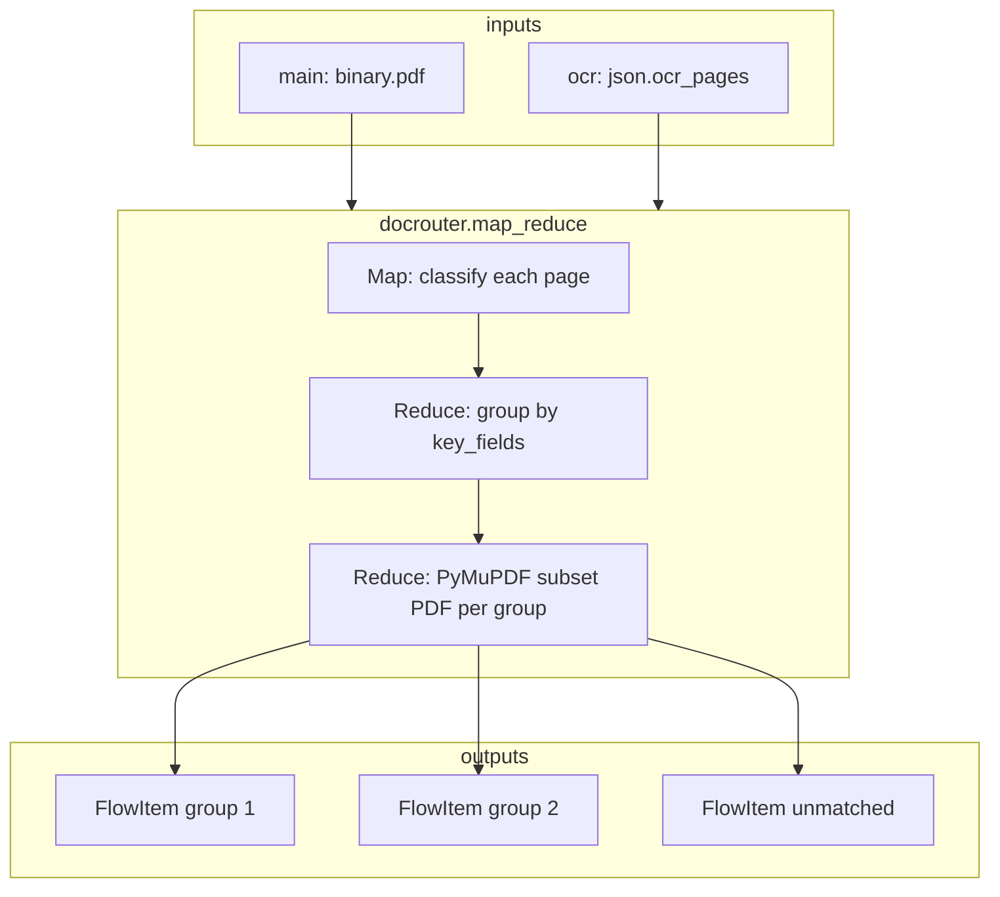

# `docrouter.map_reduce` — Implementation Plan

This document plans the **Map/Reduce** flow node: classify each page of a
multi-entity PDF, group pages by a configurable key, and emit one sub-document
per group. It is the implementation guide for [§5 of the integration
spec](./docrouter_doc_flow_integration.md).

**Reference implementation:** sibling repo
[`doc-router-temporal`](../doc-router-temporal), especially:

| Temporal artifact | Role |
| ----------------- | ---- |
| `workflows/classify_pdf_pages.py` | **Map** — run a classifier prompt on every page |
| `activities/group_classification_results.py` | **Reduce** — group pages by patient/key heuristics |
| `workflows/classify_and_group_pdf_pages.py` | Orchestrates map → reduce |
| `activities/create_and_upload_patient_pdf.py` | **Reduce output** — reassemble page subsets into PDFs |
| `workflows/classify_group_and_extract_insurance.py` | End-to-end demo (group + per-patient LLM) — **out of scope** for this node |

The Temporal insurance-extraction step is a **downstream** `docrouter.llm_run` in
flows, not part of `map_reduce`.

---

## 1. Goals

1. Add `docrouter.map_reduce` as a first-class flow node (palette, manifest, executor).
2. **Configurable classification** via org prompt + linked JSON schema (not hardcoded
   `anesthesia_bundle_page_classifier` field names).
3. Reuse in-flow OCR (`json.ocr_pages`) instead of Temporal’s per-page document upload.
4. Emit one `FlowItem` per discovered group with a reassembled sub-PDF (`binary.pdf`).
5. Match existing DocRouter flow patterns: merge node, SPU billing, execution blobs.

### Non-goals (v1)

- Porting Temporal’s full patient-specific grouping heuristics (fuzzy names, MRN/DOB
  second-pass matching, surgery-schedule detection, insurance-card adjacency merge).
- RAG / knowledge-base tool loop during per-page classification.
- Persisting classification results to `llm_runs` or creating intermediate documents.

These can be follow-ups (see §8).

---

## 2. Node contract

Aligned with [integration spec §5](./docrouter_doc_flow_integration.md#5-mapreduce-node).

### 2.1 Identity

| Field | Value |
| ----- | ----- |
| `key` | `docrouter.map_reduce` |
| `label` | Map / Reduce |
| `category` | DocRouter |
| `is_merge` | `true` (waits for **all wired** input slots — same as `docrouter.llm_run`) |
| `min_inputs` / `max_inputs` | `1` / `2` |
| `outputs` | `1` |
| `input_port_types` | `["main", "docrouter.ocr"]` |
| `output_port_types` | `["main"]` (default) |

### 2.2 Input ports

| Port | Index | Required | Type | Payload |
| ---- | ----- | -------- | ---- | ------- |
| `main` | 0 | yes | `main` | Source PDF in `binary.pdf` |
| `ocr` | 1 | yes | `docrouter.ocr` | `json.ocr_pages: string[]` (one entry per page, 0-based index = array index) |

Validation: if OCR port is wired but `ocr_pages` is missing/empty, fail the node
with a clear error (OCR must run upstream).

### 2.3 Parameters

| Parameter | Type | Required | Description |
| --------- | ---- | -------- | ----------- |
| `classifier_type` | `"llm_prompt"` \| `"keyword_rule"` | yes | Map strategy |
| `classifier_prompt_id` | `string` | when `llm_prompt` | Org prompt (latest revision). Prompt content + linked schema drive classification. UI: `org_prompt_picker`. |
| `key_fields` | `string[]` | when `llm_prompt` | Subset of schema property names used as the group key. Pages with equal values for **all** `key_fields` merge. Empty/missing key → unmatched group. |
| `keyword_rules` | `{ key: string, keywords: string[] }[]` | when `keyword_rule` | First rule whose keywords all appear (case-insensitive) in page text wins. No match → unmatched. |

**Configurable prompt + schema (user requirement):**

- **Prompt** — selected via `classifier_prompt_id`; instruction text from
  `get_prompt_content()`, optional KB text from `get_prompt_kb_system_prompt()` if we
  want parity with document LLM (recommend: yes for instruction prepend only).
- **Schema** — not a separate node parameter. Resolved from the prompt revision via
  existing `get_prompt_response_format()`. Authors configure schema in the Prompts UI;
  the node enforces structured JSON output when the model supports `response_schema`.
- **`key_fields`** — UI multi-select of schema property names (new widget
  `schema_field_multi_picker`, driven by selected prompt’s schema). Server-side
  validation: every `key_fields` entry must exist in the resolved schema `properties`.

Optional v1.1 parameters (defer unless needed immediately):

| Parameter | Purpose |
| --------- | ------- |
| `normalize_key_values` | `bool` — trim/lowercase string fields before equality (default `true`) |
| `exclude_pages_matching` | keyword list — pages matching schedule/admin patterns skipped entirely (Temporal’s surgery-schedule pass) |

### 2.4 Output items

Single output port returns `list[FlowItem]` (engine fans out to downstream nodes).

Per group item:

```json
{
  "json": {
    "group_key": { "patient_name": "…", "dob": "…" } | null,
    "page_indices": [0, 1, 2],
    "total_pages": 8,
    "classifier_type": "llm_prompt",
    "classifier_prompt_id": "…",
    "page_classifications": [ { "page_index": 0, "result": { … } }, … ]
  },
  "binary": {
    "pdf": { "storage_id": "flow_blobs:…", "mime_type": "application/pdf", … }
  },
  "meta": { "source_node_id": "…", "item_index": 0, "group_index": 0 }
}
```

- **`group_key`** — dict of `key_fields` → values for matched groups; `null` for the
  unmatched bucket.
- **`page_classifications`** — optional debug/audit payload (per-page classifier JSON).
  Omit or gate behind a parameter if payload size is a concern.
- **Order** — groups emitted in **first-seen page order**; unmatched last (omitted if empty).

### 2.5 Error handling

| Condition | Behavior |
| --------- | -------- |
| LLM returns malformed JSON for a page | Treat page as **unmatched** (do not fail whole node) |
| LLM returns `null` or `{}` | Unmatched |
| Keyword rule matches nothing | Unmatched |
| **All** pages unmatched | **Raise** — node execution fails |
| PDF page count ≠ `len(ocr_pages)` | Log warning; classify `min(pdf_pages, ocr_pages)`; unmatched indices if PDF longer |
| Missing `binary.pdf` on main input | Fail node |

---

## 3. Architecture

### 3.1 Data flow



### 3.2 Comparison with Temporal

| Step | Temporal (`doc-router-temporal`) | Flow node (`docrouter.map_reduce`) |
| ---- | -------------------------------- | ---------------------------------- |
| OCR | Per-page document upload + DocRouter OCR pipeline | Upstream `docrouter.ocr` → `ocr_pages[]` |
| Map | `run_prompt` per uploaded page doc | In-process LLM call per page (no `llm_runs` row) |
| Classifier config | Hardcoded prompt name + recursive field search | `classifier_prompt_id` + schema `key_fields` |
| Reduce grouping | `group_classification_results_activity` (patient heuristics) | Value equality on `key_fields` (v1) |
| Reduce PDF | PyPDF2 page extract + upload new document | PyMuPDF extract → `save_execution_binary_blob` |
| Downstream LLM | `classify_group_and_extract_insurance` child workflow | User wires `docrouter.llm_run` per group item |

---

## 4. Backend implementation

### 4.1 New / modified files

| File | Action |
| ---- | ------ |
| `analytiq_data/docrouter_flows/nodes/map_reduce_node.py` | **New** — `DocRouterMapReduceNode` executor |
| `analytiq_data/docrouter_flows/nodes/map_reduce.manifest.json` | **New** — manifest |
| `analytiq_data/docrouter_flows/map_reduce.py` | **New** — pure functions: classify, group, pdf subset |
| `analytiq_data/docrouter_flows/services.py` | **Extend** — `run_flow_page_classification()`, `extract_pdf_pages()` |
| `analytiq_data/common/pdf_pages.py` | **Extend** — `extract_pdf_page_subset(pdf_bytes, page_indices) -> bytes` |
| `analytiq_data/docrouter_flows/nodes/__init__.py` | Export new node |
| `analytiq_data/docrouter_flows/register.py` | Register node |
| `analytiq_data/docrouter_flows/docrouter_builtin_manifest.py` | Add manifest entry |

### 4.2 Service layer

#### `run_flow_page_classification(analytiq_client, org_id, *, prompt_id, page_text, item_json?)`

Thin wrapper around `run_flow_llm_run` optimized for **single-page** input:

- Pass `ocr_pages=[page_text]` (one page only).
- Pass minimal `item_json` (e.g. `{ "page_index": N }`) so the user message is not bloated.
- Reuse prompt resolution, model selection, `response_format` from prompt schema, SPU
  check/charge with `spu_llm_min_for_page_count(1)`.
- On `JSONDecodeError` / `ValueError` from LLM — return `None` (caller treats as unmatched).

Consider a dedicated user-message template for classification (lighter than full
`run_flow_llm_run` item dump):

```
You are classifying a single page from a larger document.

Instruction:
{classifier_instruction}

Page index: {page_index}

ocr_text:
{page_text}
```

#### `classify_pages_llm(...) -> list[PageClassification]`

```python
@dataclass
class PageClassification:
    page_index: int
    raw: dict | None          # parsed JSON or None if failed
    group_key: dict | None    # subset of raw for key_fields, normalized
```

Loop `page_index, page_text in enumerate(ocr_pages)`; call
`run_flow_page_classification` sequentially (v1). Parallelism can be a later optimization
with a concurrency cap.

#### `classify_pages_keyword(...) -> list[PageClassification]`

For each page, scan `keyword_rules` in order; first all-keywords match sets
`group_key = {"key": rule.key}` (or use rule.key as single synthetic field).

#### `group_pages_by_key(classifications) -> list[PageGroup]`

```python
@dataclass
class PageGroup:
    group_key: dict | None
    page_indices: list[int]
```

Algorithm (v1):

1. Iterate pages in order.
2. For each page with non-empty `group_key`, find existing group with equal
   `group_key` (deep equality on `key_fields` values).
3. Append page index to that group, or start a new group (preserving first-seen order).
4. Pages with `group_key is None` → unmatched list.
5. If every page is unmatched → raise `ValueError`.

**Key normalization (recommended default):**

- Strings: `strip()`; optional `casefold()` for comparison.
- Numbers/booleans: use as-is.
- `null`/missing key field → page is unmatched.

#### `extract_pdf_page_subset(pdf_bytes, page_indices) -> bytes`

In `common/pdf_pages.py` using PyMuPDF:

```python
def extract_pdf_page_subset(pdf_bytes: bytes, page_indices: list[int]) -> bytes:
    """Return a new PDF containing only the given 0-based page indices."""
```

- Skip out-of-range indices with warning.
- Preserve page order as listed in `page_indices` (sorted unique recommended before call).

#### `build_group_flow_items(...) -> list[FlowItem]`

For each `PageGroup`:

1. `subset_bytes = extract_pdf_page_subset(source_pdf, group.page_indices)`
2. `pdf_ref = await save_execution_binary_blob(..., property_name="pdf", ...)`
3. Build `FlowItem` json/binary/meta as in §2.4.

### 4.3 Node executor (`DocRouterMapReduceNode.execute`)

Mirror `DocRouterLlmRunNode`:

1. Read `main_items[0]` and paired `ocr_items[0]` (one source document per execution batch item).
2. Resolve PDF bytes via `resolve_pdf_binary_ref` + `get_binary_stream`.
3. Read `ocr_pages` from OCR item json.
4. Dispatch on `classifier_type`.
5. `groups = group_pages_by_key(classifications)`.
6. Build and return `[out_items]` (single output slot).

`validate_parameters`:

- `classifier_type` enum.
- `classifier_prompt_id` required for `llm_prompt`.
- `key_fields` non-empty array for `llm_prompt`.
- `keyword_rules` non-empty for `keyword_rule`; each rule has non-empty `key` and `keywords`.

Optional async validation hook (on flow save): resolve prompt schema and verify
`key_fields` ⊆ `schema.properties` keys.

### 4.4 SPU / billing

- **LLM classifier:** one `run_flow_page_classification` per page → each charges
  `spu_llm_min_for_page_count(1)` (same as single-page `llm_run`).
- **Keyword classifier:** no LLM SPU.
- Pre-check option: `check_spu_limits(org_id, n_pages * min_per_page)` before the loop
  to fail fast on large PDFs.

OCR SPUs are charged by upstream `docrouter.ocr`, not this node.

---

## 5. Frontend

### 5.1 Palette & icon

- Register in builtin manifest loader (already driven by `DOCROUTER_NODES`).
- Add `icon_key: "map_reduce"` to icon map (or reuse a generic split icon).

### 5.2 Parameter UI

| Parameter | Widget |
| --------- | ------ |
| `classifier_type` | `enum` select |
| `classifier_prompt_id` | `org_prompt_picker` (existing) |
| `key_fields` | **New** `schema_field_multi_picker` — loads schema for selected prompt, multi-select property names |
| `keyword_rules` | **New** `keyword_rules_editor` — repeatable rows: key + keywords tag input |

`x-ui-show-when` patterns (same as OCR Textract features):

- Show `classifier_prompt_id` + `key_fields` when `classifier_type == "llm_prompt"`.
- Show `keyword_rules` when `classifier_type == "keyword_rule"`.

### 5.3 Connection validation

- OCR port must accept only `docrouter.ocr` (already enforced by connection types).
- Editor hint: “Connect Run OCR → Map/Reduce (OCR port).”

---

## 6. Tests

### 6.1 Unit tests — `map_reduce.py`

| Test | Assert |
| ---- | ------ |
| `group_pages_by_key` equal keys merge | Pages `{a:1}`, `{a:1}` → one group |
| Different keys → separate groups | Order preserved |
| Null/empty key → unmatched | |
| All unmatched → raises | |
| Key normalization | `"Smith"` vs `" smith "` merge when normalize on |

### 6.2 Unit tests — `pdf_pages.extract_pdf_page_subset`

| Test | Assert |
| ---- | ------ |
| 3-page PDF, indices `[0,2]` | Output has 2 pages |
| Out-of-range index | Skipped / warned |

### 6.3 Service tests — `run_flow_page_classification`

- Mock `agent_completion`; assert single-page message shape and schema `response_format` passed through.

### 6.4 Node integration tests — `test_docrouter_map_reduce_node.py`

Pattern from `test_docrouter_llm_run_node.py`:

- Merge node wiring (main + OCR).
- LLM classifier: mock classification returns → N output items with correct `page_indices`.
- Malformed JSON page → unmatched bucket.
- Keyword classifier: keyword hit/miss.
- All pages fail → execution error.

### 6.5 Engine test

- Multi-item output from one node propagates to downstream node (existing fan-out behavior).

---

## 7. Example flow (insurance bundle)

Replicates Temporal’s `classify_group_and_extract_insurance` **without** embedding
insurance logic in the node:

```
docrouter.trigger (document.uploaded)
  → docrouter.ocr
  → docrouter.map_reduce
       classifier_type: llm_prompt
       classifier_prompt_id: <page classifier prompt>
       key_fields: ["patient_first_name", "patient_last_name", "dob", "mrn"]
  → docrouter.llm_run          # runs once per group item
       prompt_id: <insurance_card prompt>
  → docrouter.save_as_document / docrouter.save_result
```

Authors define the classifier prompt schema in the Prompts UI, e.g.:

```json
{
  "type": "object",
  "properties": {
    "patient_first_name": { "type": "string" },
    "patient_last_name": { "type": "string" },
    "dob": { "type": "string" },
    "mrn": { "type": "string" },
    "document_type": { "type": "string" }
  }
}
```

`key_fields` selects the identity fields; `document_type` can be present in classification
but excluded from the group key (e.g. insurance cards matched manually downstream or via
a future grouping mode).

---

## 8. Follow-ups (post-v1)

### 8.1 Temporal-style advanced grouping

Port slices of `group_classification_results.py` as optional `grouping_mode`:

| Mode | Behavior |
| ---- | -------- |
| `exact` (v1 default) | `key_fields` value equality |
| `temporal_patient` | Multi-pass name/MRN/DOB matching, fuzzy merge, adjacency heuristics |

Keep patient-specific logic out of the default path so generic documents (invoices,
contracts) work with schema-driven keys only.

### 8.2 Performance

- Bounded parallel page classification (`asyncio.Semaphore`).
- Batch SPU pre-check.
- Skip `page_classifications` in output json by default.

### 8.3 Observability

- Per-page timing in execution trace / node run metadata.
- Summary: `groups_found`, `unmatched_pages`, `classification_failures`.

---

## 9. Implementation phases

| Phase | Deliverable | Est. |
| ----- | ----------- | ---- |
| **A — Core reduce** | `extract_pdf_page_subset`, `group_pages_by_key`, keyword classifier, unit tests | 1–2 days |
| **B — LLM map** | `run_flow_page_classification`, prompt+schema wiring, SPU | 1 day |
| **C — Node + manifest** | `DocRouterMapReduceNode`, register, manifest, node tests | 1 day |
| **D — Frontend** | Parameter widgets, show-when, palette icon | 1–2 days |
| **E — E2E** | Example flow in docs; manual test with multi-patient PDF | 0.5 day |

**Suggested PR split:**

1. Backend core (phases A–C) — reviewable without UI.
2. Frontend (phase D).
3. Docs / example flow (phase E).

---

## 10. Open questions

1. **`page_classifications` in output** — include by default for debugging, or behind
   `include_page_classifications: bool` (default `false`)?
2. **KB system prompt on classifier** — prepend KB text for flow classification prompts?
3. **Date normalization** — should `dob` values be normalized to ISO before grouping
   (Temporal parses many formats), or require schema/prompt to emit canonical strings?
4. **Concurrent LLM calls** — acceptable in v1 with sequential calls for simpler SPU
   accounting, or require parallel from the start for 100+ page PDFs?

---

## 11. Acceptance criteria

- [ ] `docrouter.map_reduce` appears in palette and validates parameters.
- [ ] Flow: `trigger → ocr → map_reduce` splits a multi-entity PDF into N group items.
- [ ] Classifier prompt and JSON schema are configurable via org Prompts UI (no code changes).
- [ ] `key_fields` controls which schema properties define groups.
- [ ] Each output item has `binary.pdf` (flow blob) and `json.page_indices`.
- [ ] Malformed per-page LLM output → unmatched, not full failure.
- [ ] All pages unmatched → node fails.
- [ ] Tests cover grouping, PDF subset, node execution, and merge-port wiring.
